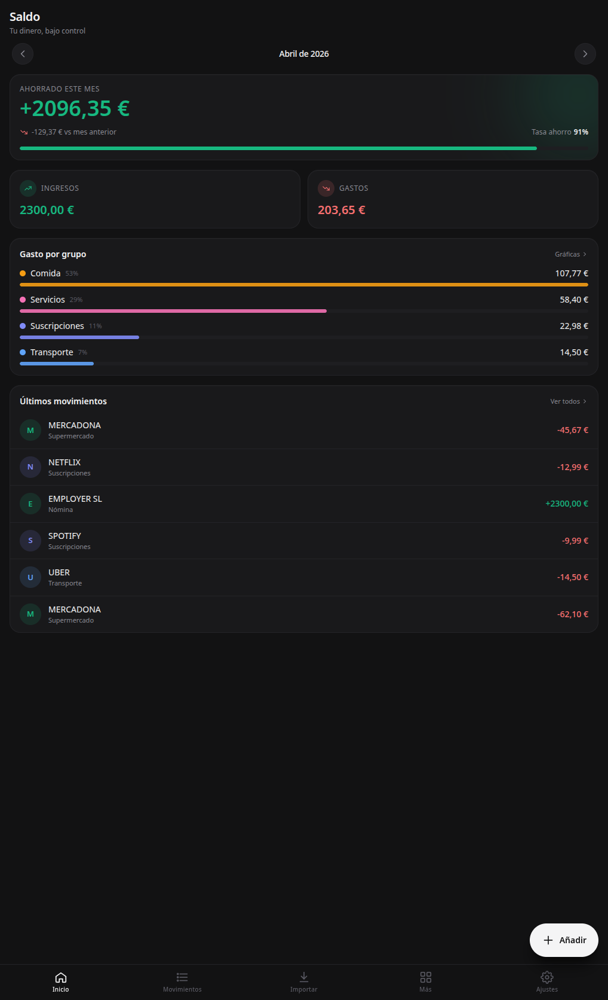

# Saldo

> Control de gastos y ahorros, 100% local y privado.

[](https://github.com/alvarotorresc/Saldo/actions/workflows/ci.yml)
[](./LICENSE)



## Qué es

App móvil (y web) para llevar tus finanzas sin ceder tus datos a nadie. Movimientos, categorías, presupuestos y metas viven en tu dispositivo — sin servidor, sin cuentas, sin tracking.

## Características (v0.2.0)

### Datos

- Dashboard con dos modos: **Sobrio** (hero NET tweened + 3 métricas +
  sparkline 30D + breakdown top 5 + recent tx) y **Charts** (ring savings
  rate, AreaChart con range selector 7D/30D/90D/12M/YTD, StackedBars 12M,
  Donut con colapso OTROS, HeatmapCal 30D, budgets mini-rings).
- Ledger terminal-style con search `$ grep -e`, filter sheet (período, tipo,
  categorías, importe), pull-to-refresh que re-aplica reglas.
- Tx detail con hero 42px, KV list (con HASH SHA-256 canónico), notes inline,
  rule matched card, related tx, tombstones al borrar.
- New tx con calculator amount input, segmented EXPENSE/INCOME/TRANSFER y
  shared toggle.
- Budgets con proyección end-of-month, Rules con toggle on/off + hits +
  preview en vivo, Categories con sparkline por grupo.
- Goals con ring + €/mes calculados, Subscriptions con summary mensual/anual,
  Loans con amortización, Net Worth agregado (cash + saved goals − loans).
- Analytics: RUNNING_NET 12M, TOP_CATEGORIES YoY, TOP_MERCHANTS, YEAR_HEATMAP
  365d.

### Import / Export

- CSV **N26** y **BBVA** con detección automática, confidence score por fila
  (filas <0.8 marcadas para revisar) y categorización automática por reglas.
- Export a **`.saldo`** (snapshot v2 con tombstones), **`.json`**, **`.csv`**
  (RFC-4180), **`.ofx`** (SGML 1.x, compatible YNAB/GnuCash), **`.pdf`** (jspdf).

### Seguridad (local-first, end-to-end)

- **PIN 4-6 dígitos** + derivación PBKDF2 (600k iteraciones, SHA-256).
- **Biometría real** (huella / face ID) vía `@capgo/capacitor-native-biometric`
  v8. El PIN se guarda en el keystore/keychain del sistema; auto-trigger en
  LockPage.
- **Cifrado at-rest** de toda la DB: al bloquear, la DB se serializa, se
  cifra con AES-256-GCM + SHA-256 y se guarda en localStorage; Dexie queda
  vacía. Al desbloquear, se descifra y restaura.
- **Tombstones** que sobreviven export/import → round-trip preserva borrados.
- **Cambiar PIN** sin perder datos (re-wrap master key con salt nuevo).
- **Wipe** completo (Dexie + vault + biometric credentials + snapshot cifrado).

### UX

- Paleta de comandos (fuzzy) con ↑↓ + Enter + Esc.
- Quick Actions Sheet 3×3 (long-press en el FAB).
- TerminalEmpty / TerminalLoading (spinner + checklist ✓/…/○/✗) / TerminalError
  (formato rust-like con retry y copy-trace).

## Tech stack

- Vite 6 + React 18 + TypeScript 5
- Tailwind CSS 3
- Dexie 4 (IndexedDB)
- Zustand (estado)
- **Capacitor 8** (Android + iOS)
- jspdf 4 (export PDF)
- Web Crypto API (AES-256-GCM + PBKDF2)

## Desarrollo local

### Requisitos

- Node.js >= 20
- npm

### Instalación

```bash
git clone https://github.com/alvarotorresc/Saldo.git
cd Saldo
npm install
npm run dev
```

## Scripts

| Comando                   | Descripción                           |
| ------------------------- | ------------------------------------- |
| `npm run dev`             | Servidor de desarrollo                |
| `npm run build`           | Build de producción                   |
| `npm run typecheck`       | Type checking con TypeScript          |
| `npm run cap:add:android` | Añadir proyecto Android (primera vez) |
| `npm run android:build`   | Build APK debug                       |

El APK generado queda en `android/app/build/outputs/apk/debug/app-debug.apk`.

## Privacidad

Todos los datos viven en tu dispositivo (IndexedDB). Sin servidor, sin analytics, sin tracking.

## Licencia

MIT — ver [LICENSE](./LICENSE).
